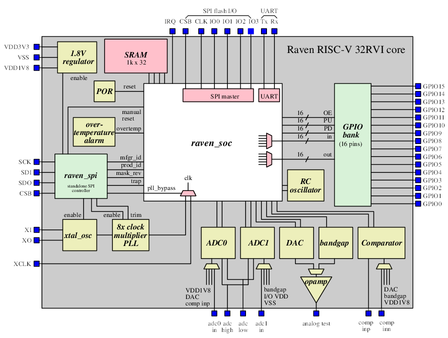

Raven:  An ASIC implementation of the PicoSoC PicoRV32
===============================================================
Designed by efabless engineering, San Jose, CA

Overview
--------

The purpose of this repository is to provide a completely free
and open-source simulation environment for the Raven chip.  The
Raven chip itself can be found in the efabless IP catalog.  See
https://efabless.com (registration is required to view the IP
catalog.  Regitration is free and validation is not required to
view the catalog contents.  However, validation is required to
use the efabless design environments; e.g., to view the layout
of the raven chip on the Open Galaxy design platform).

The simulation environment matches the reference design in the
efabless IP catalog functionally, and can be used to write
software/firmware that will run on the Raven test board.

The requirements for simulating the Raven chip are:  iverilog
(iverilog.icarus.com), and the RISC-V gcc configured for the
RISC-V options used by the picoRV32 processor design.  The best
way to obtain the correct gcc cross-compiler is to install the
picoRV32 source from github
(https://github.com/cliffordwolf/picorv32).  The Makefile in
the picoRV32 repository automatically downloads and locally
installs the correct gcc cross-compiler.  In this repository,
it is necessary to change the path to gcc in verilog/Makefile
and verilog/*/Makefile to match the local installation.  Once
that is done, cd to the "verilog/" directory and run "make" to
run the simulation test suite.

Documentation on the memory mapping and the SPI slave interface
can be found in the "doc/" directory.

Summary
-------

Raven is using a very popular 32-bit RISC-V core (PicoRV32) developed by Clifford Wolf, a well-known open source champion. The core was previously proven with an FPGA implementation and Raven is the first SoC built with it. The system integrator is our own Tim Edwards, another champion in the open source domain. Included below is a 15s video showing the wakeup, key features and a link to high-level datasheet.

Raven is now published in our marketplace for designers and partner companies to clone and customize starting from a silicon-proven point. It is also published on the RISC-V Foundation’s directory of designs
(https://riscv.org/risc-v-cores)

RAVEN Block Diagram
-------------------

Key Features
------------
* RISC-V CPU (PicoRV32)
* SRAM 32x1024
* 100 MHz clock rate
* Programmable clock source
* 16 channels GPIO
* 2 ADCs
* 1 DAC
* 1 Comparator
* Over-temperature alarm
* 100 kHz RC oscillator
* Programmable functions on GPIO outputs
* Programmable interrupts on GPIO inputs

High-level Datasheet 
---------------------
* https://ef.link/raven

Short Video showing initial wakeup
----------------------------------
* https://ef.link/raven3

## License
